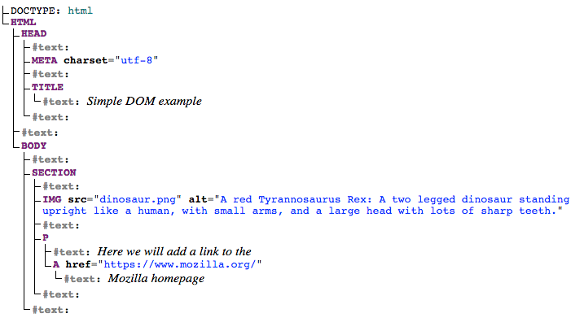

# What is a Document Object Model

**MDN Definition:** The Document Object Model (DOM) connects web pages to scripts or programming languages by representing the structure of a document—such as the HTML representing a web page—in memory.

-   **Tree structure**: The DOM represents a web page as a tree-like structure of objects.

-   **Elements as nodes**: Each HTML element becomes a node in this tree, with parent-child relationships.

-   **Manipulation tool**: It allows JavaScript to interact with and change web page content dynamically.

-   **Live representation**: Changes made to the DOM instantly update what you see on the web page.

```html
<!doctype html>
<html lang="en-US">
  <head>
    <meta charset="utf-8" />
    <title>Simple DOM example</title>
  </head>
  <body>
    <section>
      
      <p>
        Here we will add a link to the
        <a href="https://www.mozilla.org/">Mozilla homepage</a>
      </p>
    </section>
  </body>
</html>
```

