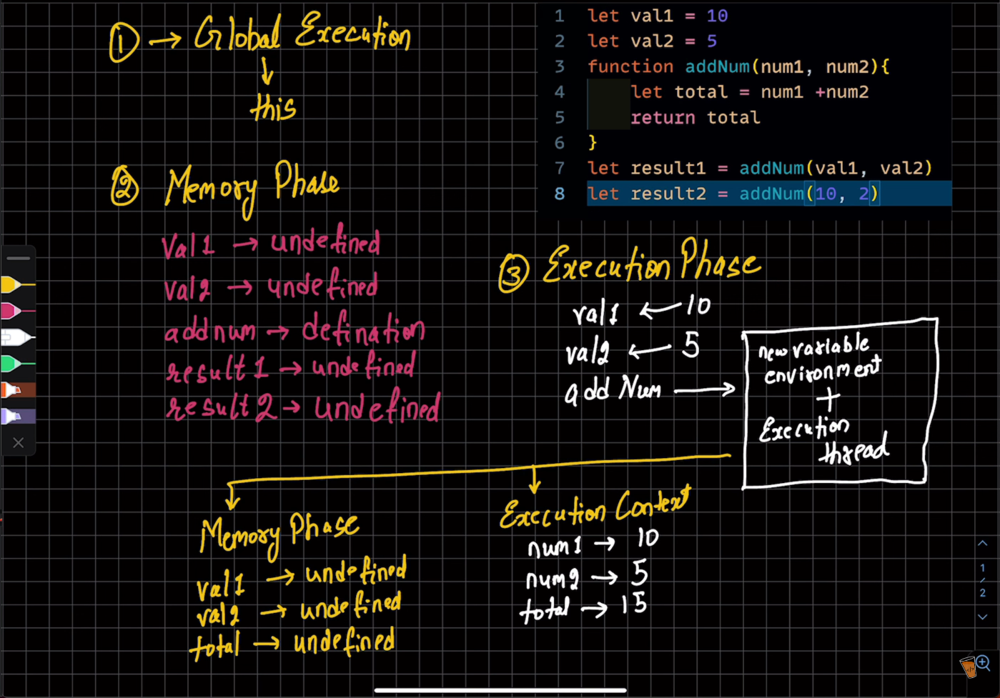

# Complier Augmentation Process

The DOM rendering process in million.js has 3 main steps `complie(pre), diff and patch(post)`

## Compile Step

-   The optimizing complier will analyse the DSL and target the hyperscript of the source code to remove redundant code.

-   The complier implements `node flattening` and static `tree hoisting` which targets the hyperscript and improves the load time and rendering speed.

## Keywords

### Domain Specific Lanuguage

```javascript
<div>Hello World</div>
```

### Hyperscript

```javascript
// Before flattening (hyperscript):
h("div", null, "Hello World");
```

### Node Flattening

```javascript
// Before flattening (hyperscript):
h('div', null, 'Hello World');

// After flattening:
{
  tag: 'div',
  children: ['Hello World'],
  flag: Flags.ONLY_TEXT_CHILDREN
};
```

### Static Tree Hoisting

**JavaScript Definition For Hoisting**:Access variables and function even before they have been declared in the code.

#### Reduction in Memory Allocation

-   _Single Allocation_: Allocated only once during the initial load of the application.

-   _Reuse of Static Structures_: Any further references of such static parts will lead to reuse

-   _Global Scope Placement_: Persist throughout the application's lifecycle, reducing garbage collection overhead.




[Next Topic: The Diff Step](./diff.md)