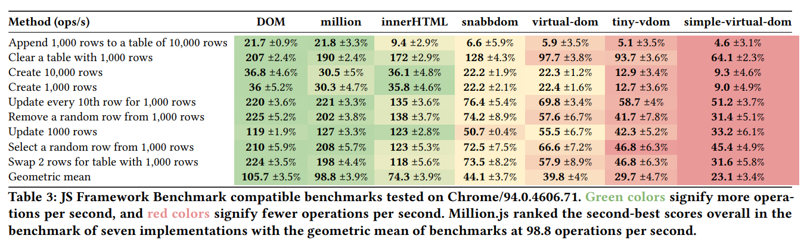
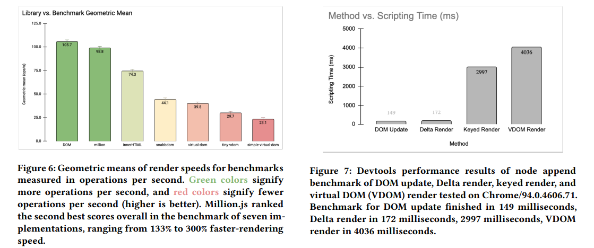
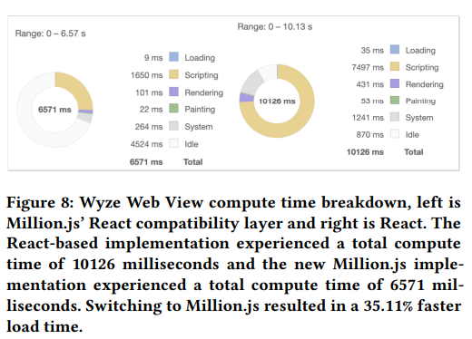

# Evaluation

Tested on 10 different measurement benchmark suites on seven different implmentations of web page rendering using a subject of the JS Framework Benchmark

## js-framework-benchmark

A comparison of the performance of a few popular javascript frameworks

Reference: https://krausest.github.io/js-framework-benchmark/current.html

## Real World Application Performance

Wyze Web View, a Next.js-based application for displaying live smart home camera feeds, serves thousands of daily users but suffered from long load times.

### Specific performance improvements(35.11% Improvement)

**React:** 10,126ms total compute time, 7,497ms scripting time
**Million.js:** 6,571ms total compute time, 1,650ms scripting time

An informal study with ten active users after migration showed that all participants reported reduced load times and less perceived lag.

[Next Slider: The Future](./future.md)
