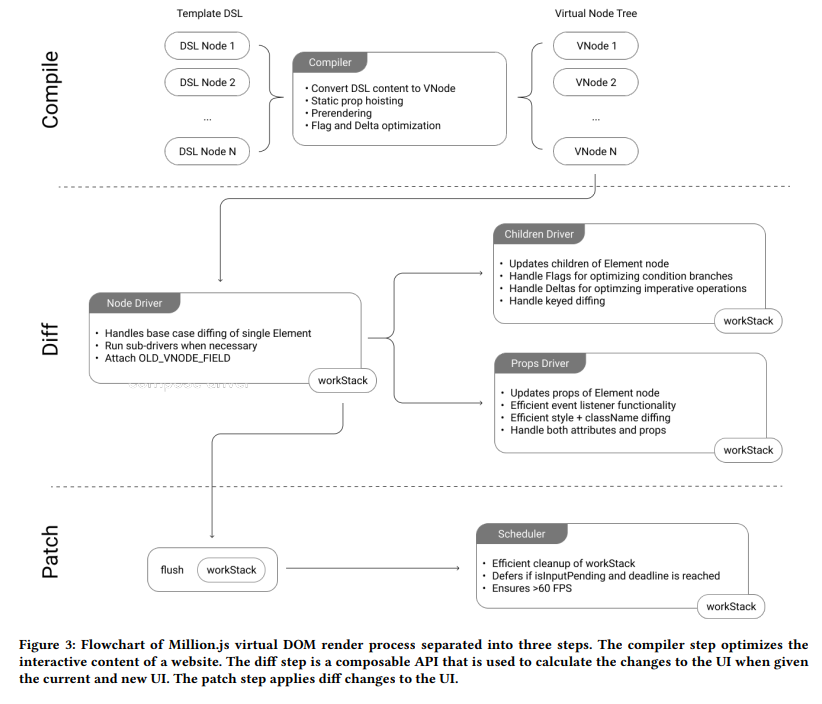

# Patching Step

The patch step takes the calculated UI changes from the diff step and applies those to the UI using a Two-Pass Format

## Process Details

### Two-Pass Format

-   First pass: Handles virtual DOM change calculations, using the results from the diff step
-   Second pass: Deals with browser reflow and repaint calculations

### DOM Updates

-   Applies calculated changes to the actual DOM
-   May involve creating, removing, or updating DOM nodes

## Implementation Flowchart

[Next Topic: The Benchmarks](./evaluation.md)